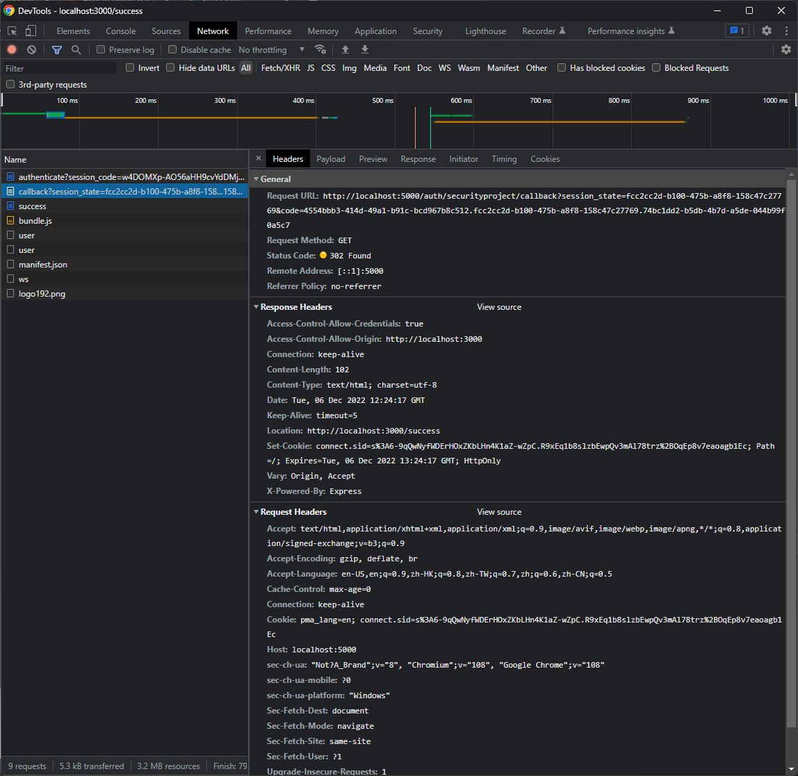

# Case studies of Keycloak, node-oauth in implementing Authorization Code Flow

## Contents

- [Case studies of Keycloak, node-oauth in implementing Authorization Code Flow](#case-studies-of-keycloak-node-oauth-in-implementing-authorization-code-flow)
  - [Contents](#contents)
  - [Introduction](#introduction)
  - [Redirecting to Authorization Endpoint](#redirecting-to-authorization-endpoint)
  - [Authenticating user, Redirecting with authorization code](#authenticating-user-redirecting-with-authorization-code)
  - [Requesting Access Token](#requesting-access-token)
  - [Redirecting with Access Token](#redirecting-with-access-token)

## Introduction

This case studies will focus on reviewing how Keycloak and node-oauth implement Authorization Code Flow in OAuth Protocal, which Keycloak is an authorization server and node-oauth is the user-agent. Each sections refer a step in protocol flow, which are redirecting to authorization endpoint, authenticating user, redirecting with authorization code, requesting an access token, redirecting with access token.

## Redirecting to Authorization Endpoint

In the first step of authorization code flow, the third party application should create authorization request, specifies the `response_type`, `redirect_uri` and `client_id`.

We have used `node-oauth` javascript library for creating the request. The following code snippets are how the library creates the request.

```javascript
var params = this.authorizationParams(options);
params.response_type = "code";
```

```javascript
var parsed = url.parse(self._oauth2._authorizeUrl, true);
utils.merge(parsed.query, params);
parsed.query["client_id"] = self._oauth2._clientId;
delete parsed.search;
var location = url.format(parsed);
self.redirect(location);
```

The following is a sample url created by the library, and its prettier version.

```
http://localhost:8081/realms/master/protocol/openid-connect/auth?response_type=code&redirect_uri=http://localhost:5000/auth/securityproject/callback&client_id=comp-internet-sec
```

```
http://localhost:8081/realms/master/protocol/openid-connect/auth

response_type = code
redirect_uri  = http://localhost:5000/auth/securityproject/callback
client_id     = comp-internet-sec

```

Reference: [node-oauth](https://github.com/ciaranj/node-oauth)

## Authenticating user, Redirecting with authorization code

Authentication server are responsible create the authorization code, and send to the third-party application. In Keycloak, the server creates an `GET` endpoint `/auth` to handle the request. The method `process()` class `AuthorizationEndpoint` is responsible to make this response. It first validates the request, and return errors if fails. If the checking is success, it creates an authentication session and build the authorization code response.

Before building the code response, it will check whether the user authenicates or not via the method `authenticate()` in class `AuthenticationProcessor`. It will retrieve the user intended authentication from database, calling the method `authenticate()` from interface `Authenticator` for authentication. If the authentication flow is successful, it updates the database to create authenticated user, followed by calling `processor.finishAuthentication()` for logging, refreshing cookies and finally start building the code response via method `authenticated()` in interface `LoginProtocal`. For OAuth2 Login, it use `OIDCLoginProtocol` that implements `LoginProtocol`, creating the `302` response that contains an URL with the persisted code and session state.

The following code segment shows the code that generates the authorization code, which Keycloak use random UUID for implementation.

```java
String code = null;
if (responseType.hasResponseType(OIDCResponseType.CODE)) {
    OAuth2Code codeData = new OAuth2Code(UUID.randomUUID().toString(),
            Time.currentTime() + userSession.getRealm().getAccessCodeLifespan(),
            nonce,
            authSession.getClientNote(OAuth2Constants.SCOPE),
            authSession.getClientNote(OIDCLoginProtocol.REDIRECT_URI_PARAM),
            authSession.getClientNote(OIDCLoginProtocol.CODE_CHALLENGE_PARAM),
            authSession.getClientNote(OIDCLoginProtocol.CODE_CHALLENGE_METHOD_PARAM));

    code = OAuth2CodeParser.persistCode(session, clientSession, codeData);
    redirectUri.addParam(OAuth2Constants.CODE, code);
}
```

The following image capture the redirected response containing the authorization code.



## Requesting Access Token

After the user-agent receives the authorization code, it request authorization server again to get the access token. In `node-oauth`, function `getOAuthAccessToken()` can create the access token request. The created request attachs the authorization code to query string and
other required information such as `grant_type`, `redirect_uri`, `client_id`, and `client_secret`.

The following code snippet show some of the related code snippets for creating the access token request in function `getOAuthAccessToken()`.

```javascript
  params["client_id"] = this._clientId;
  params["client_secret"] = this._clientSecret;
  var codeParam =
    params.grant_type === "refresh_token" ? "refresh_token" : "code";
  params[codeParam] = code;

  var post_data = querystring.stringify(params);
  var post_headers = {
    "Content-Type": "application/x-www-form-urlencoded",
  };

  this._request(
    "POST",
    this._getAccessTokenUrl(),
    post_headers,
    post_data,
    null,
    function (error, data, response) {
      if (error) callback(error);
      else {
        var results;
        try {
          results = JSON.parse(data);
        } catch (e) {
          results = querystring.parse(data);
        }
        var access_token = results["access_token"];
        var refresh_token = results["refresh_token"];
        delete results["refresh_token"];
        callback(null, access_token, refresh_token, results);
      }
    }
  );
};
```

The following is the sample post body of the access token request, and the prettier version.

```
grant_type=authorization_code&redirect_uri=http%3A%2F%2Flocalhost%3A5000%2Fauth%2Fsecurityproject%2Fcallback&client_id=comp-internet-sec&client_secret=bdeOQGB3n6sQMPPbl0pnQEZUgRNsCDFf&code=16f17672-8530-41e3-af41-c3c1eb635c82.961bd503-9518-4e89-92aa-da134383f681.74bc1dd2-b5db-4b7d-a5de-044b99f0a5c7
```

```
grant_type    = authorization_code
redirect_uri  = http://localhost:5000/auth/securityproject/callback
client_id     = comp-internet-sec
client_secret = bdeOQGB3n6sQMPPbl0pnQEZUgRNsCDFf
code          = 16f17672-8530-41e3-af41-c3c1eb635c82.961bd503-9518-4e89-92aa-da134383f681.74bc1dd2-b5db-4b7d-a5de-044b99f0a5c7
```

## Redirecting with Access Token

Authorization Server should handle the access token token request. `Keycloak` creates a `POST` endpoint `/token` in class `TokenEndPoint`. It detects the grant type, and it executes `codeToToken()` method for handling request of authorization code grant type. The `codeToToken()` may first validate the content in the request such as `code` and `user_session`. It the validation is successful, it updates the user session, and invoke the method `createClientAccessToken()` that creates the token response. The method `encode()` in class `DefaultTokenManager` build the jwt token.

```java
    @Override
    public String encode(Token token) {
        String signatureAlgorithm = signatureAlgorithm(token.getCategory());

        SignatureProvider signatureProvider = session.getProvider(SignatureProvider.class, signatureAlgorithm);
        SignatureSignerContext signer = signatureProvider.signer();

        String encodedToken = new JWSBuilder().type("JWT").jsonContent(token).sign(signer);
        return encodedToken;
    }
```

The method `sign()` starts build the jwt token.

```java
public String sign(SignatureSignerContext signer) {
    kid = signer.getKid();

    StringBuilder buffer = new StringBuilder();
    byte[] data = marshalContent();
    encode(signer.getAlgorithm(), data, buffer);
    byte[] signature = null;
    try {
        signature = signer.sign(buffer.toString().getBytes(StandardCharsets.UTF_8));
    } catch (Exception e) {
        throw new RuntimeException(e);
    }
    return encodeAll(buffer, signature);
}
```

From the building process of `jwt`, it first encode the jwt JOSE Header and claims set using base64,

```java
protected void encode(String sigAlgName, byte[] data, StringBuilder encoding) {
    encoding.append(encodeHeader(sigAlgName));
    encoding.append('.');
    encoding.append(Base64Url.encode(data));
}
```

Followed by signing the encoded string using Message Authentication Code (MAC) in the method `sign()` for verifying the encode string. in the class `MacSignatureSignerContext`. The variable `key` can specifies the signing algorithm such as RS256 and HS256 and its secret key.

```java
@Override
public byte[] sign(byte[] data) throws SignatureException {
    try {
        Mac mac = Mac.getInstance(JavaAlgorithm.getJavaAlgorithm(key.getAlgorithmOrDefault()));
        mac.init(key.getSecretKey());
        mac.update(data);
        return mac.doFinal();
    } catch (Exception e) {
        throw new SignatureException("Signing failed", e);
    }
}
```

The following is the example of the created access token signed with RS256. It can be separated into three parts by the `.` character, which refers to the JOSE header, claims set, and the signature.

```
eyJhbGciOiJSUzI1NiIsInR5cCIgOiAiSldUIiwia2lkIiA6ICJvVnFpV2ZDZzllTm5ubVM1LUhTMXduTWhkemo2OVpieTZXTW1mQ0VPQy1NIn0.eyJleHAiOjE2NzAzNDYxMjgsImlhdCI6MTY3MDM0NjA2OCwiYXV0aF90aW1lIjoxNjcwMzQ1NDYwLCJqdGkiOiJjMjhmMzI1Yy1iNmFmLTQ0NDEtOTcxMi1lNDQ5NmI2Mjk3YjIiLCJpc3MiOiJodHRwOi8vbG9jYWxob3N0OjgwODEvcmVhbG1zL21hc3RlciIsImF1ZCI6WyJtYXN0ZXItcmVhbG0iLCJhY2NvdW50Il0sInN1YiI6IjYzYzFhMTQzLTY1NGQtNGQwMC1iZjRmLWUwMzUwODk4MjI0OCIsInR5cCI6IkJlYXJlciIsImF6cCI6ImNvbXAtaW50ZXJuZXQtc2VjIiwic2Vzc2lvbl9zdGF0ZSI6Ijk2MWJkNTAzLTk1MTgtNGU4OS05MmFhLWRhMTM0MzgzZjY4MSIsImFjciI6IjAiLCJyZWFsbV9hY2Nlc3MiOnsicm9sZXMiOlsiY3JlYXRlLXJlYWxtIiwiZGVmYXVsdC1yb2xlcy1tYXN0ZXIiLCJvZmZsaW5lX2FjY2VzcyIsImFkbWluIiwidW1hX2F1dGhvcml6YXRpb24iXX0sInJlc291cmNlX2FjY2VzcyI6eyJtYXN0ZXItcmVhbG0iOnsicm9sZXMiOlsidmlldy1yZWFsbSIsInZpZXctaWRlbnRpdHktcHJvdmlkZXJzIiwibWFuYWdlLWlkZW50aXR5LXByb3ZpZGVycyIsImltcGVyc29uYXRpb24iLCJjcmVhdGUtY2xpZW50IiwibWFuYWdlLXVzZXJzIiwicXVlcnktcmVhbG1zIiwidmlldy1hdXRob3JpemF0aW9uIiwicXVlcnktY2xpZW50cyIsInF1ZXJ5LXVzZXJzIiwibWFuYWdlLWV2ZW50cyIsIm1hbmFnZS1yZWFsbSIsInZpZXctZXZlbnRzIiwidmlldy11c2VycyIsInZpZXctY2xpZW50cyIsIm1hbmFnZS1hdXRob3JpemF0aW9uIiwibWFuYWdlLWNsaWVudHMiLCJxdWVyeS1ncm91cHMiXX0sImFjY291bnQiOnsicm9sZXMiOlsibWFuYWdlLWFjY291bnQiLCJtYW5hZ2UtYWNjb3VudC1saW5rcyIsInZpZXctcHJvZmlsZSJdfX0sInNjb3BlIjoicHJvZmlsZSBlbWFpbCIsInNpZCI6Ijk2MWJkNTAzLTk1MTgtNGU4OS05MmFhLWRhMTM0MzgzZjY4MSIsImVtYWlsX3ZlcmlmaWVkIjpmYWxzZSwicHJlZmVycmVkX3VzZXJuYW1lIjoiYWRtaW4ifQ.S-TwkLGhI5lAJVphW5yctXFYZ1S2dL0kOlYIQjymFLfm86wsFhxnPQrj7ELp5zKAzVSxJZ0HE4oK8hhxSLl9ssBQ8w44JwRa3t4tkDjYUtdg_pG5AbuHY9n-YYD_KdcSQPGPMyqd1QA-r32qgH6Bbi7Qg5Jb0ys6DwAwzgdkIKJMtbkhUrxImfoucF6HP9zUBH-7rtnf_KB_wlNJLj7Ba1PPbAHUMkUU-gi_cv8FnblxajrqPYp3jlAAF2cz9LEREiuLKqyFxpe2cHi2OjsQxXiqVPPMKT7pt10fEjrqpH_umSk9ZsbG-C3t4O_NKaGuH2m6lvXoo6LjNyth9JHhsg
```

Lastly, it fills other information that is related to the token, which includes the type and lifespan of the token. The following shows an example of the access token response body.

```
{
  access_token: 'eyJhbGciOiJSUzI1NiIsInR5cCIgOiAiSldUIiwia2lkIiA6ICJvVnFpV2ZDZzllTm5ubVM1LUhTMXduTWhkemo2OVpieTZXTW1mQ0VPQy1NIn0.eyJleHAiOjE2NzAzNDYxMjgsImlhdCI6MTY3MDM0NjA2OCwiYXV0aF90aW1lIjoxNjcwMzQ1NDYwLCJqdGkiOiJjMjhmMzI1Yy1iNmFmLTQ0NDEtOTcxMi1lNDQ5NmI2Mjk3YjIiLCJpc3MiOiJodHRwOi8vbG9jYWxob3N0OjgwODEvcmVhbG1zL21hc3RlciIsImF1ZCI6WyJtYXN0ZXItcmVhbG0iLCJhY2NvdW50Il0sInN1YiI6IjYzYzFhMTQzLTY1NGQtNGQwMC1iZjRmLWUwMzUwODk4MjI0OCIsInR5cCI6IkJlYXJlciIsImF6cCI6ImNvbXAtaW50ZXJuZXQtc2VjIiwic2Vzc2lvbl9zdGF0ZSI6Ijk2MWJkNTAzLTk1MTgtNGU4OS05MmFhLWRhMTM0MzgzZjY4MSIsImFjciI6IjAiLCJyZWFsbV9hY2Nlc3MiOnsicm9sZXMiOlsiY3JlYXRlLXJlYWxtIiwiZGVmYXVsdC1yb2xlcy1tYXN0ZXIiLCJvZmZsaW5lX2FjY2VzcyIsImFkbWluIiwidW1hX2F1dGhvcml6YXRpb24iXX0sInJlc291cmNlX2FjY2VzcyI6eyJtYXN0ZXItcmVhbG0iOnsicm9sZXMiOlsidmlldy1yZWFsbSIsInZpZXctaWRlbnRpdHktcHJvdmlkZXJzIiwibWFuYWdlLWlkZW50aXR5LXByb3ZpZGVycyIsImltcGVyc29uYXRpb24iLCJjcmVhdGUtY2xpZW50IiwibWFuYWdlLXVzZXJzIiwicXVlcnktcmVhbG1zIiwidmlldy1hdXRob3JpemF0aW9uIiwicXVlcnktY2xpZW50cyIsInF1ZXJ5LXVzZXJzIiwibWFuYWdlLWV2ZW50cyIsIm1hbmFnZS1yZWFsbSIsInZpZXctZXZlbnRzIiwidmlldy11c2VycyIsInZpZXctY2xpZW50cyIsIm1hbmFnZS1hdXRob3JpemF0aW9uIiwibWFuYWdlLWNsaWVudHMiLCJxdWVyeS1ncm91cHMiXX0sImFjY291bnQiOnsicm9sZXMiOlsibWFuYWdlLWFjY291bnQiLCJtYW5hZ2UtYWNjb3VudC1saW5rcyIsInZpZXctcHJvZmlsZSJdfX0sInNjb3BlIjoicHJvZmlsZSBlbWFpbCIsInNpZCI6Ijk2MWJkNTAzLTk1MTgtNGU4OS05MmFhLWRhMTM0MzgzZjY4MSIsImVtYWlsX3ZlcmlmaWVkIjpmYWxzZSwicHJlZmVycmVkX3VzZXJuYW1lIjoiYWRtaW4ifQ.S-TwkLGhI5lAJVphW5yctXFYZ1S2dL0kOlYIQjymFLfm86wsFhxnPQrj7ELp5zKAzVSxJZ0HE4oK8hhxSLl9ssBQ8w44JwRa3t4tkDjYUtdg_pG5AbuHY9n-YYD_KdcSQPGPMyqd1QA-r32qgH6Bbi7Qg5Jb0ys6DwAwzgdkIKJMtbkhUrxImfoucF6HP9zUBH-7rtnf_KB_wlNJLj7Ba1PPbAHUMkUU-gi_cv8FnblxajrqPYp3jlAAF2cz9LEREiuLKqyFxpe2cHi2OjsQxXiqVPPMKT7pt10fEjrqpH_umSk9ZsbG-C3t4O_NKaGuH2m6lvXoo6LjNyth9JHhsg',
  expires_in: 60,
  refresh_expires_in: 1800,
  refresh_token: 'eyJhbGciOiJIUzI1NiIsInR5cCIgOiAiSldUIiwia2lkIiA6ICIwNGZmZWU1NS0yMzg1LTQ5OWItOGM3My0wYjA5YWI5MjQxYjUifQ.eyJleHAiOjE2NzAzNDc4NjgsImlhdCI6MTY3MDM0NjA2OCwianRpIjoiZjBiZWEyZTMtMDNjNS00NWE2LWEyMDQtYzFkZDBmYmJlMjgxIiwiaXNzIjoiaHR0cDovL2xvY2FsaG9zdDo4MDgxL3JlYWxtcy9tYXN0ZXIiLCJhdWQiOiJodHRwOi8vbG9jYWxob3N0OjgwODEvcmVhbG1zL21hc3RlciIsInN1YiI6IjYzYzFhMTQzLTY1NGQtNGQwMC1iZjRmLWUwMzUwODk4MjI0OCIsInR5cCI6IlJlZnJlc2giLCJhenAiOiJjb21wLWludGVybmV0LXNlYyIsInNlc3Npb25fc3RhdGUiOiI5NjFiZDUwMy05NTE4LTRlODktOTJhYS1kYTEzNDM4M2Y2ODEiLCJzY29wZSI6InByb2ZpbGUgZW1haWwiLCJzaWQiOiI5NjFiZDUwMy05NTE4LTRlODktOTJhYS1kYTEzNDM4M2Y2ODEifQ.v3vyoimJ89nUtRVREk5qvu2skbcCZLG8_6PqHePYzgE',
  token_type: 'Bearer',
  'not-before-policy': 0,
  session_state: '961bd503-9518-4e89-92aa-da134383f681',
  scope: 'profile email'
}
```
